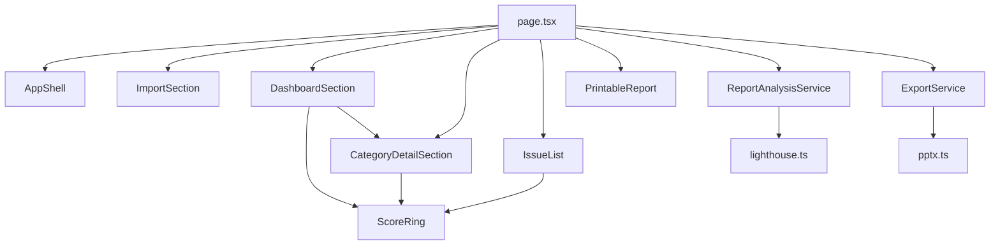

# Component Dependencies — lighthouse-insights-v2

## Dependency rules
- **Presentational components** depend only on props + shared `ScoreRing` — never import services directly
- **page.tsx** is the only UI module that calls `ReportAnalysisService` / `ExportService`
- **Services** depend on `lib/*` only — not on React components
- **CategoryDetailSection** appears only when `selectedCategoryId` is set (inline under Dashboard grid)
- **Circular deps forbidden**: components ↛ services ↛ components

## Coupling notes
- Selecting a category updates page state → re-renders Dashboard highlight + CategoryDetailSection + optionally filters IssueList (Construction choice: filter vs show all below)
- Export/Reset disabled when `report === null`
