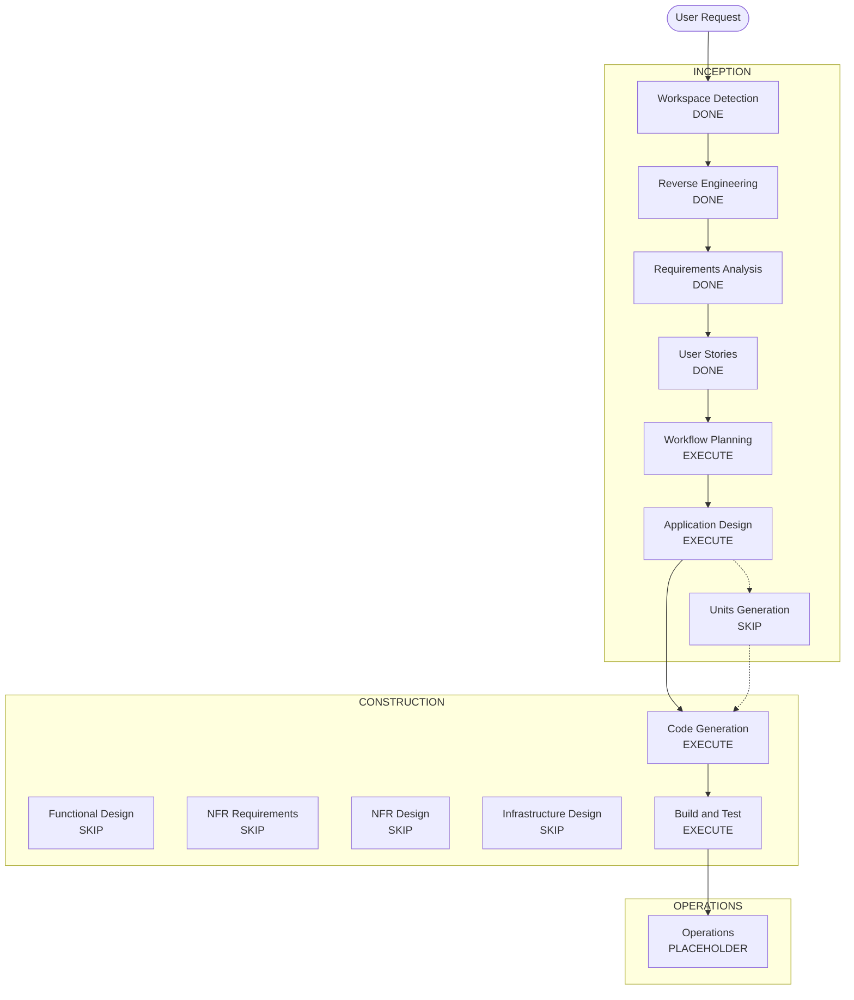

# Execution Plan — lighthouse-insights-v2

## Detailed Analysis Summary

### Transformation Scope (Brownfield)
- **Transformation Type**: Single-app UI / presentation layer (within `web/`)
- **Primary Changes**: Design tokens, typography, continuous-page sections matching Stitch screens; split monolithic `page.tsx` into focused components
- **Related Components**: `globals.css`, `layout.tsx`, `lighthouse.ts` (minor helpers e.g. overall average), `pptx.ts` (unchanged), print-root (preserve)

### Change Impact Assessment
- **User-facing changes**: Yes — layout, chrome, Import/Dashboard/Issues presentation
- **Structural changes**: Yes — component split under `web/` (no new packages/services)
- **Data model changes**: No — reuse existing report types
- **API changes**: No backend
- **NFR impact**: Light — XSS-safe rendering, virtual lists, parse/export errors (cloud NFRs N/A)

### Component Relationships
- **Primary Component**: `web` Next.js app
- **Infrastructure Components**: None
- **Shared Components**: `web/src/lib/lighthouse.ts`, `pptx.ts`
- **Dependent Components**: None external
- **Change Priority**: Critical path = design tokens → chrome → Import → Dashboard → Issues → Export verify

### Risk Assessment
- **Risk Level**: Medium (large UI rewrite; parse/export must not regress)
- **Rollback Complexity**: Easy (git revert; no schema/migrations)
- **Testing Complexity**: Moderate (manual UI pass + lint/build; optional focused unit tests on score average helper)

### Module Update Strategy
- **Update Approach**: Sequential within single `web` package
- **Critical Path**: tokens/fonts → AppShell → ImportView → DashboardView → Issues/Category → wire exports
- **Coordination Points**: Shared report state in page/shell
- **Testing Checkpoints**: After Import parse; after Dashboard scores; after Export PDF/PPTX

## Stage Decisions

| Stage | Decision | Rationale |
|-------|----------|-----------|
| User Stories | DONE | Approved |
| Application Design | **EXECUTE** | Split monolith into shell + section components; define boundaries |
| Units Generation | **SKIP** | UI-only monolith; one sequential construction stream (stories US-01…10) |
| Functional Design (per unit) | **SKIP** | Stories + requirements AC sufficient; avoid duplicate design docs |
| NFR Requirements / NFR Design | **SKIP** | NFRs already in `requirements.md`; no new cloud NFRs |
| Infrastructure Design | **SKIP** | No infra |
| Code Generation | **EXECUTE** | Implement UI in `web/` |
| Build and Test | **EXECUTE** | `lint` + `tsc`/`build`; manual AC checklist from stories |

## Workflow Visualization

## Construction Sequence (Code Generation)

Aligned with story Q5-A and US-01…10:

1. **US-01 / US-02** — Tokens, fonts, Material Symbols, logo header, footer  
2. **US-03** — Stitch Import section (keep parse/upload/paste)  
3. **US-04 / US-05 / US-06** — Overall health, Quick Wins, category breakdown  
4. **US-07 / US-08** — Issue cards + category detail pattern + virtual list  
5. **US-09 / US-10** — Header Export PDF/PPTX + Reset; verify print-root  

## Proposed Application Design Focus (next stage)
Components (tentative — refine in Application Design):
- `AppShell` (header/footer)
- `ImportSection`
- `DashboardSection` (health, quick wins, category grid)
- `CategoryDetailSection` / `IssueList` (virtualized)
- Keep domain in `lighthouse.ts` (+ `getOverallScore` helper)
- Preserve `PrintableReport` + pptx path

## Out of Scope (unchanged)
Sidebar, bottom nav, Settings, Recent Reports, export deck redesign, auth/avatars
