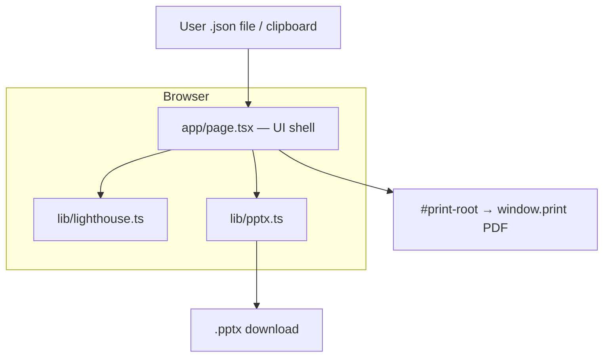
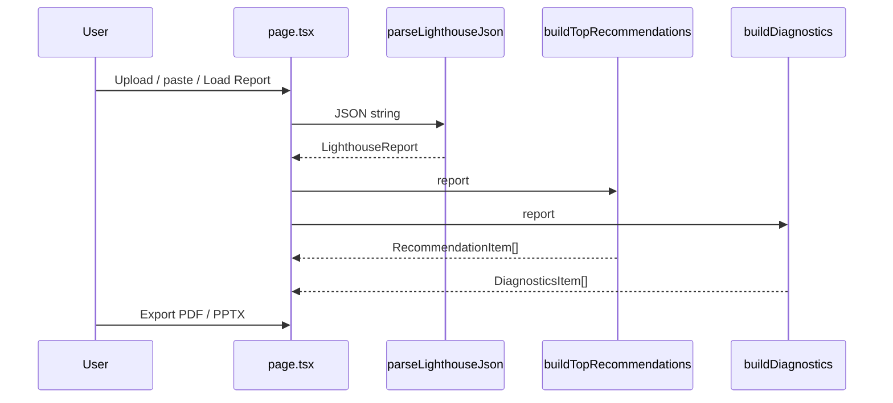

# System Architecture

## System Overview
Single Next.js 16 App Router client application. All Lighthouse processing happens in-browser. No backend API, auth, or database.

## Architecture Diagram

## Component Descriptions

### `web/app/page.tsx`
- **Purpose**: Monolithic client UI (import panel + dashboard + print root)
- **Responsibilities**: State for JSON text/report, parse/export handlers, score cards, issue lists (virtualized)
- **Dependencies**: lighthouse.ts, pptx.ts, @tanstack/react-virtual, next/image
- **Type**: Application

### `web/app/layout.tsx` / `globals.css`
- **Purpose**: Root layout, fonts, design tokens, print CSS
- **Type**: Application

### `web/src/lib/lighthouse.ts`
- **Purpose**: Parse and derive insights from Lighthouse JSON
- **Type**: Application / Domain

### `web/src/lib/pptx.ts`
- **Purpose**: PPTX export
- **Type**: Application

## Data Flow

## Integration Points
- **External APIs**: None at runtime (portfolio/GitHub links only)
- **Databases**: None (Recent Reports planned for localStorage in v2)
- **Third-party Services**: None; libraries: Next.js, React 19, Tailwind 4, pptxgenjs, @tanstack/react-virtual

## Infrastructure Components
- **Deployment Model**: Static/SSR-capable Next app (local `next dev` / host TBD)
- **CDK / Terraform**: None
