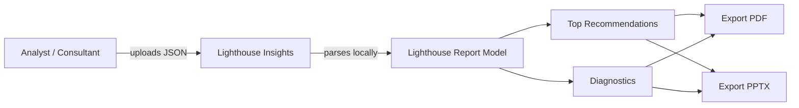

# Business Overview

## Business Context Diagram

## Business Description
- **Business Description**: Client-side tool that turns a Google Lighthouse JSON export into a client-ready summary (Top 10 issues + Diagnostics) with PDF and PPTX exports. Runs fully in the browser; no server-side report storage.
- **Business Transactions**:
  1. **Import Report** — Upload, paste, or drag-drop Lighthouse JSON and parse it
  2. **Analyze Insights** — View category scores, top impactful issues, and diagnostics
  3. **Export Deliverable** — Generate PDF (print) or PPTX for a client
  4. **Reset Session** — Clear text area and parsed report
- **Business Dictionary**:
  - **Lighthouse report** — Official JSON from Chrome DevTools Lighthouse panel
  - **Category score** — 0–100 Performance / Accessibility / Best Practices / SEO
  - **Priority** — Heuristic `(100 - scorePct) × weight` used to order Top 10
  - **Diagnostics** — Audits tagged with group `diagnostics` (plus additional issues)

## Component Level Business Descriptions

### web (Next.js app)
- **Purpose**: Entire product UI and client-side processing
- **Responsibilities**: Import UX, score visualization, issue lists, exports, branding

### web/src/lib/lighthouse.ts
- **Purpose**: Domain model and business logic for parsing and ranking audits
- **Responsibilities**: Parse JSON, category scores, Top N recommendations, diagnostics

### web/src/lib/pptx.ts
- **Purpose**: Client-ready PowerPoint generation
- **Responsibilities**: Cover + Top 10 + Diagnostics slides via pptxgenjs
